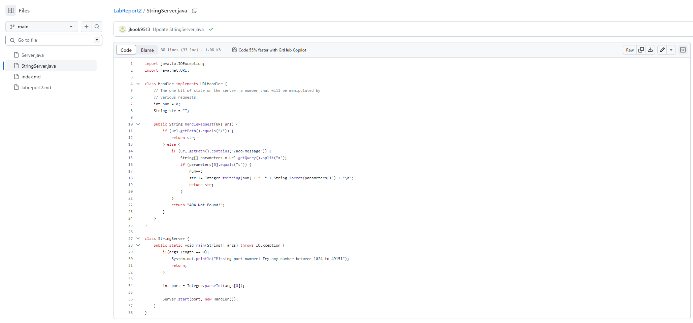
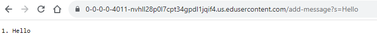
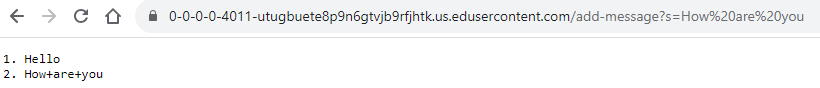
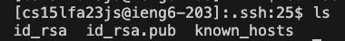
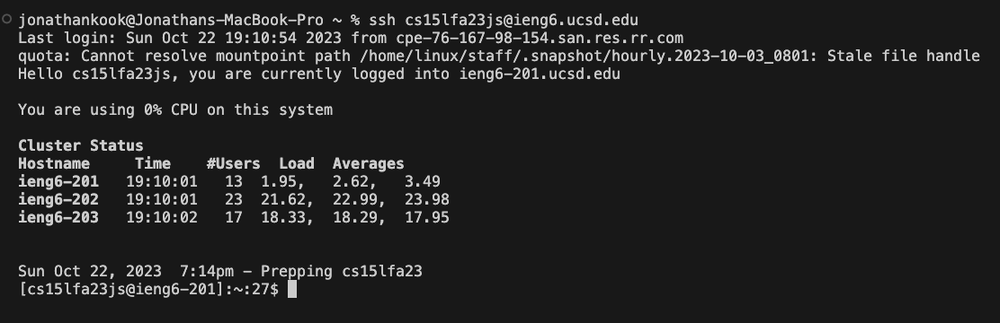

* The code for `/StringServer.java` is shown in the screenshot above.

* In the screenshot above, the `handleRequest` method is called.
* The only relevant argument to this method is `URI url`.
* The relevant fields are the string `str`, the integer `num`, and the other string `s`. 
* Value of `str`:   '1. Hello'
* Value of `num`: 1
* Value of `s`: Hello

* In the screenshot above, the `handleRequest` method is called.
* The only relevant argument to this method is `URI url`.
* The relevant fields are the string `str`, the integer `num`, and the other string `s`. 
* Value of `str`:  
'1. Hello'  
'2. How are you'
* Value of `num`: 2
* Value of `s`: How are you

* The path to the private and public keys are shown in the screenshot. The path the the private key is `/id_rsa`. The path to the public key is `/id_rsa.pub`.

* The screenshot above shows a login into ieng6 with my course-specific account without being asked for a password.

* In weeks 2 and 3 I learned multiple new commands including `ssh`, `mkdir`, and `scp`. The `ssh` command is a protocol used to securely connect to a remote server or system. The `mkdir` command is a command used to create a new directory. The `scp` command copies files or directories between a local and a remote system, or between two remote systems. I also learned how to locally connect to a remote server.
